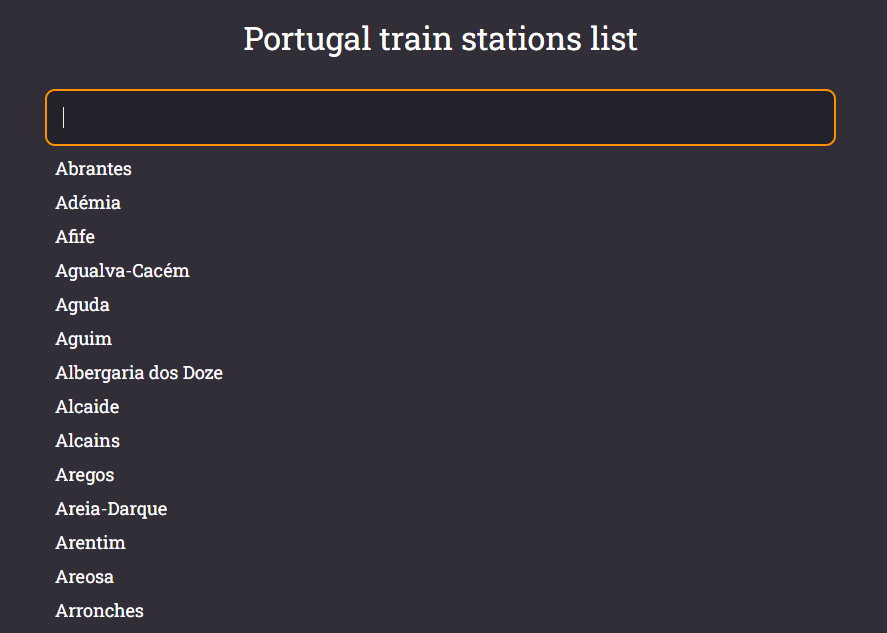

# Search bar exercise

Project made to exercise search of a string in an array of data. As the user types each character, the display show all valid choices for the next character and list of possible matching items.


## Tecnologies and libs

 - [React](https://reactjs.org/)
 - [Styled Components](https://styled-components.com/)


## Screenshots




## Run Locally

Clone the project

```bash
  git clone https://github.com/luisscarlos/search-bar-react.git
```

Go to the project directory

```bash
  cd search-bar-react
```

Install dependencies

```bash
  yarn install
```

Start the server

```bash
  yarn start
```


## Demo

[Search bar demo](https://search-bar-react.vercel.app/)


## License

[MIT](https://choosealicense.com/licenses/mit/)

